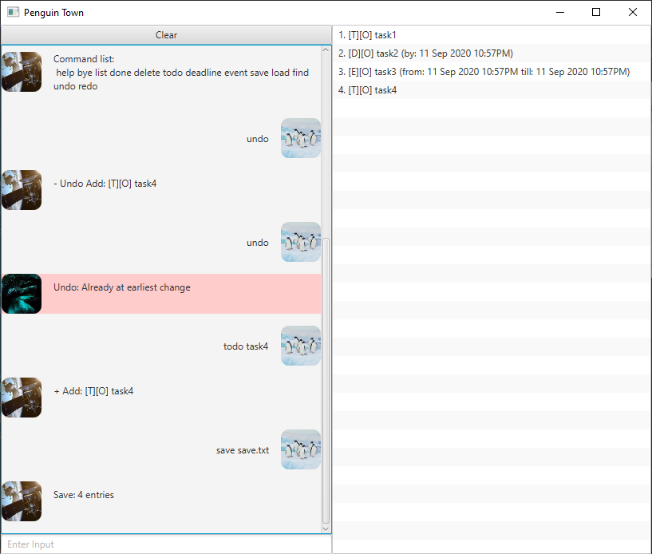

# User Guide

Penguin town is the most robust task manager to meet the needs of every penguin's busy lifestyle.

## Command list

Task Operations:
- [Add a todo (task)](#add-a-todo-todo)
- [Add a deadline (task)](#add-a-deadline-deadline)
- [Add an event (task)](#add-an-event-event)
- [List all task](#list-all-task-list)
- [Mark task as completed](#mark-task-as-completed-done)
- [Remove a task](#remove-a-task-delete)
- [Finding a task](#finding-a-task-find)
- [Undo an action](#undo-an-action-undo)
- [Redo an action](#redo-an-action-redo)

File Operations:
- [Save to disk](#save-to-disk-save)
- [Load from disk](#load-from-disk-load)

Others:
- [List all command](#list-all-command-help)
- [Exit the application](#exit-the-application-bye)

## Features 

### Add a todo: `todo`
Add a todo to the list.

A todo is a task with a `description`

    Format: todo <description>
    
        <description>: A string consisting of characters [a-zA-z0-9_ ]
        
    Example: 'todo catch 4 fishes for the little penguins'
 
 
 
### Add a deadline: `deadline`
Add a deadline to the list.

A deadline is a task with a `description`, 
and an end time specified by `by/<time>`.

    Format: deadline <description> by/<time>
    
        <description>: A string consisting of characters [a-zA-z0-9_ ]
        <time>: A date time in the format "ddMMyyyy HHmm"
    
            dd - day (1-31)
            MM - month (1-12)
            yyyy - year (e.g. 2021)
            HH - hour (0-23)
            mm - minute (0-59)
            
        Example: '20012020 1800' means 20 Jan 2020 06:00pm

    Example: 'deadline feed the little penguins by/20012020 1800'
 
 
 
### Add an event: `event`
Add an event to the list.

An event is a task with a `description`, 
a start time specified by `from/<time>`, 
and an end time specified by `till/<time>`

    Format: event <description> from/<time> till/<time>
    
        <description>: A string consisting of characters [a-zA-z0-9_ ]
        <time>: A date time in the format "ddMMyyyy HHmm"
    
            dd - day (1-31)
            MM - month (1-12)
            yyyy - year (e.g. 2021)
            HH - hour (0-23)
            mm - minute (0-59)
            
        Example: '20012020 1800' means 20 Jan 2020 06:00pm

    Example: 'event penguin new year from/07072020 0700 till/07072020 1900'

 

### List all task: `list`
List all tasks in the list.

    Format: list
    
Expected outcome: Application will display all tasks in the task list

 

### Mark task as completed: `done`
Mark a task as completed.

    Format: done <index>
    
        <index>: The index of the task in the list
        
    Example: 'done 2' marks the 2nd item in the list as completed
    
A completed task is marked with a 'X' e.g. 

An incomplete task is marked with a 'O' e.g. 

 

### Remove a task: `delete`
Remove a task from the list.

    Format: delete <index>
    
        <index>: The index of the task in the list
        
    Example: 'delete 4' removes the 4th item from the list

 

### Finding a task: `find`
Search the list for tasks containing `keyword`.

    Format: find <keyword>
    
        <keyword>: A string consisting of characters [a-zA-z0-9_ ]
        
    Example: 'find penguin on ice' will display all tasks containing 'penguin on ice'
    
 

### Save to disk: `save`
Save the task list to disk.

    Format: save <filename>
    
        <filename>: Path to file consisting of characters [a-zA-z0-9_ ./]
            - File will be created if does not exist
            - Operation fails if directory does not exist
        
    Example: 'save my task list.txt' will save into file 'my task list.txt'
    Example: 'save data/save1.txt' will save into file 'save1.txt' residing in 'data' directory

 

### Load from disk: `load`
Load the task list from disk.

    Format: load <filename>
    
        <filename>: Path to file consisting of characters [a-zA-z0-9_ ./]
        
    Example: 'load my task list.txt' will load from file 'my task list.txt'
    Example: 'load data/save1.txt' will load from file 'save1.txt' residing in 'data' directory
    
 

### Undo an action: `undo`
Undo the previous action.

Only `todo`, `deadline`, `event`, `done`, `delete` and `redo` commands can be undone.

Running the `load` command resets the command history, causing all
previous actions to be no longer undoable

    Format: undo

Expected outcome: Previous command is undone

 

### Redo an action: `redo`
Redo the previous undo.

The `redo` command is only available when an `undo` command is performed.

    Format: redo
    
Expected outcome: Previous undo command is undone

 

### List all command: `help`
Display command list.

    Format: help
    
Expected outcome: The full command list is displayed

 

### Exit the application: `bye`
Exit the application.

    Format: bye

Remember to save your work before running this command.